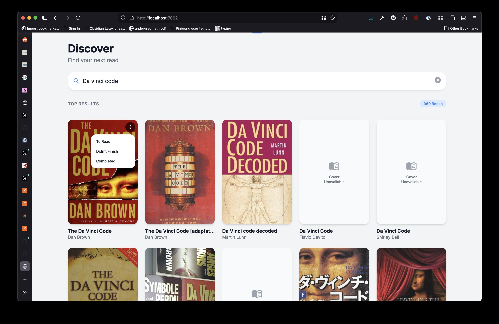

# nee-reads

A simple goodreads clone for NeeNee.



## Prerequisites

- Python 3.11+
- Node.js 20+
- uv (Python package manager)

## Getting Started

### Install uv

```bash
curl -LsSf https://astral.sh/uv/install.sh | sh
```

### Install Dependencies

Python dependencies:
```bash
uv sync
```

Frontend dependencies:
```bash
cd web && npm install
```

### Running the API

```bash
uv run uvicorn api.main:app --reload --port 7002
```

The API will be available at http://localhost:7002

### Running the Frontend (Development)

```bash
cd web && npm run dev
```

The frontend will be available at http://localhost:5173

## Running Tests

### Python Tests

```bash
uv run pytest
```

### Frontend Tests

```bash
cd web && npm test
```

## Docker

### Development (with hot reload)

For local development with hot reload, use the `dev` profile:

```bash
docker-compose --profile dev up --build
```

This starts:
- API server at http://localhost:7002 (with hot reload)
- Vite dev server at http://localhost:7003 (with hot reload)

### Production

To run the production build:

```bash
docker-compose up --build
```

The application will be available at http://localhost:7002
